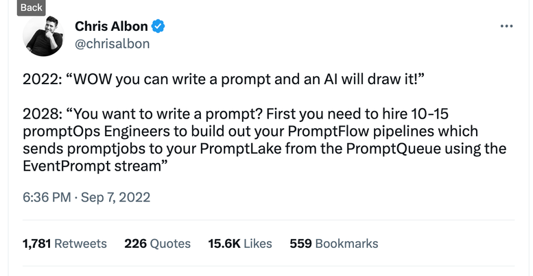

# lazy-chain
Simple &amp; lazy prompt management &amp; chaining

**Q: Why lazy-chain?**
To keep prompt chaining simple and very easy to use and avoid the following:

<!---

-->

[TWEET_IMAGE_PATH]: ./Chris_ablon_on_prompt_engineering.png
[TWEET_URL]: https://twitter.com/chrisalbon/status/1567688342124503040
